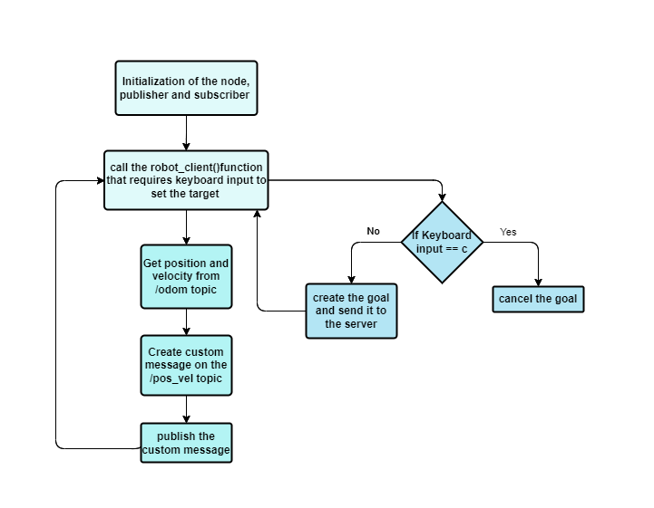

# ROS SIMULATOR

> Professor Carmine Recchiuto, 
 Student: Anna Possamai

## INSTALL AND RUN

- First of all, we need to run the master by typing:

    roscore

- Then, clone inside the `src` folder of the ROS workspace the assignment package `Assignment2_2022_ResearchTrack` from this github.

- Then, from the root directory of the ROS workspace type:

    catkin_make

- Before running the program for the first time, install **xterm**, by typing the following command:

    sudo apt-get install xterm

- Finally, to run the code, type:

    roslaunch Assignment2_2022_ResearchTrack assignment1.launch

## ASSIGNMENT DESCRIPTION

In this assignment it is asked to implement, in **ROS**, a mobile robot.
This robot has to reach a desired position in a 3D environment, by moving on the xy plane and avoiding obstacles.
In particular it is required to implement three nodes and a launch file as follow:

- (a) A node that implements an action client, allowing the user to set a target (x, y) or to cancel it. 
      The node also publishes the robot position and velocity as a custom message (x,y, vel_x, vel_z), by relying on the values published on the topic /odom. 
- (b) A service node that, when called, prints the number of goals reached and cancelled;
- (c) A node that subscribes to the robot’s position and velocity (using the custom message) and prints the distance of the robot from the target and the robot’s average speed. Use a parameter to set how fast the node publishes the information.
- Create a launch file to start the whole simulation. Set the value for the frequency with which node (C) publishes the information.

## NODES

Inside the scripts directory there are six python file that represent the nodes:

1. `bug_as.py` implement an action server node that requires services to bring the robot to the target position.

2. `go_to_point_service.py` implement a service node that move the robot to the desired position.

3. `wall_follow_service.py` implement a service node that allows the robot to avoid obstacles.

4. `action_client_A.py` implement an action client node that allows the user to set the target (x,y) or to cancel it by keyboard input in the console; then, it publish the robot position and velocity as a custom message (pos_vel), by relying on the values publish on the topic /odom.

    The structure of this node is described in the following flowchart:

<figure>

<figcaption align = "center"></figcaption>
</figure>
 

5. `service_node_B.py` implement the service node that, when it is called, prints the number of goals reached and cancelled;

6. `dist_vel_C.py` implement the node that subscribes to the robots position and velocity (using the custom message) and prints on the console the distance of the robot from the target (set in node action_client_A), and its average speed with the frequency set as a parameter in the launch file.

After the program launch file has been run, four windows appears:

- **Gazebo** is the 3D simulator environment that as a realistic rendering of the environment and the robots.
- **Rviz** is a 3D visualization tool for ROS. It allows the user to view the simulated robot model, log sensor information from the robot's sensors, and replay the logged sensor information.
- Whithin the **action_client_A.py** window the user can set the new target or cancel it from keyboard.
- Whithin the **dist_vel_C.py** window the distance from the target and the average speed of the robot are shown.

- To know the number of goals reached and canceled (implemented in the service_node_B.py), type on another tab:

      rosservice call /n_goal

- You can set the frequency from the launch file `assignment1.launch` inside of the `launch` folder, by changing the value and relaunch the program.

## FUTURE IMPROVEMENTS

- In some cases if the desired position is in the same position of an obstacle, the robot crash into it. A possible improvement to avoid it could be the implementation of a function that recognise if the target position is on an obstacle, and when it happens allert the user and asks for another goal position;
- It could be implemented a function that allows the robot to take the closest way to get to the target;
- The graphical interface could be improve by adding a x,y frame with the corresponding coordinates in the environment and also a graphical marker for the target position, to get a better visualization of the target position and to allow a better inserting of the target coordinates from the user.
